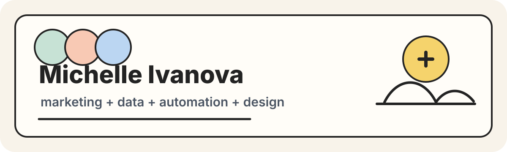

  

##  &nbsp; about me
 &nbsp; marketer who builds data-driven systems and AI-assisted products 
 &nbsp; turning manual workflows into automated pipelines 
 &nbsp; focused on creating systems for automation and simplifying workflows 
 &nbsp; open to remote roles in tech, AI marketing, and data systems

##  &nbsp; fav repos

| name | description |
|------|-------------|
| [`din-tai-fung-bot`](https://github.com/michelleivanova/din-tai-fung-bot) | automation bot project with a practical, real-world workflow |
| [`music-analytics-and-anomaly-detection-system`](https://github.com/michelleivanova/music-analytics-and-anomaly-detection-system) | streaming analytics engine for momentum, rolling baselines, and anomaly detection |
| [`catalogwatch-ai-agent`](https://github.com/michelleivanova/catalogwatch-ai-agent) | AI agent for catalog research and copyright termination intelligence |
| [`Catalog-Metadata-QA---Enrichment-Pipeline-Project`](https://github.com/michelleivanova/Catalog-Metadata-QA---Enrichment-Pipeline-Project) | metadata QA and enrichment pipeline for catalog cleanup |

##  &nbsp; toolbox

##  &nbsp; connect

 &nbsp; linkedin: [`michelle-ivanova`](https://www.linkedin.com/in/michelle-ivanova)  
 &nbsp; portfolio: [`michelleivanova.lovable.app`](https://michelleivanova.lovable.app)
